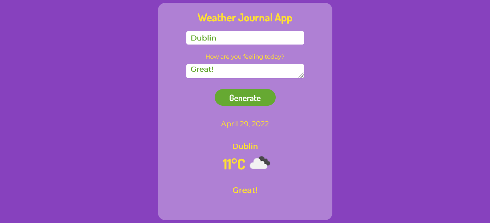

# Weather Journal App
## Udacity Nanodegree Project 

Weather Journal is ad app that allows users to get weather info in their region.

```
# Start the application
$ npm start
```
Open http://localhost:8000 to view it in your browser.



### Technologies used:
* JavaScript, HTML, CSS, Weather API

